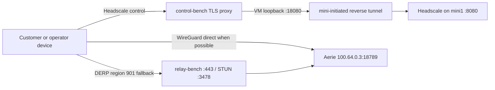
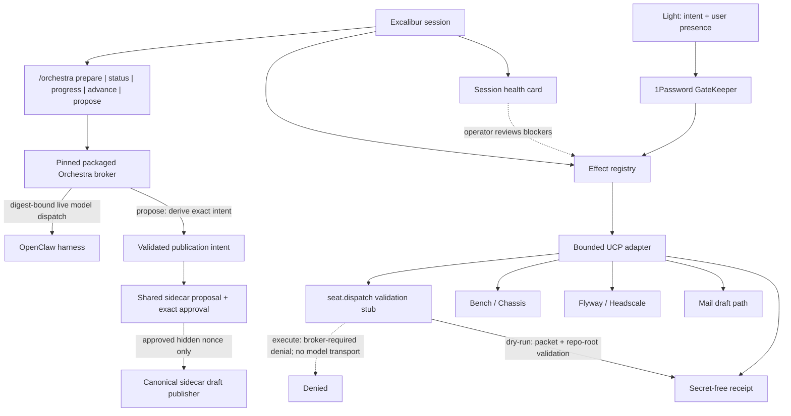

# Unified Control Plane architecture

**Status:** implemented foundation plus explicit live-proof residuals 
**Scope:** Excalibur Native, the OpenClaw harness, Bench/Chassis, and the Flyway mesh 
**Operator:** Light 
**Security posture:** observe and prepare by default; every unknown or unverifiable condition fails closed

## 1. Purpose

The Unified Control Plane (UCP) gives an Excalibur CLI session a small set of typed, reviewable ways to do work that the existing operator boundary correctly denies in the general case. It does not remove that boundary. It replaces broad shell authority with named effects, narrow grants, user-presence checks, and durable secret-free receipts.

The two end-to-end outcomes are:

1. Turn a bounded Pattern A packet into a **draft** pull request for a human to land.
2. Support a contractor customer from live Bench truth, adding a web CS grant or optional mesh node only when the health card and tenant boundary support it.

The UCP never merges, deploys, marks a PR ready, silently mutates a tenant, or sends external mail under an ordinary session grant.

## 2. Non-negotiable invariants

- **Observed reality wins.** Static topology is an expected-state hint. A probe disagreement is drift to report, not a reason to rewrite production config.
- **MacBook is a node, not the brain.** A successful `127.0.0.1:18789` probe on the MacBook may be a forward to mini1; it is not proof of a local gateway.
- **One Slack socket.** mini1 owns the bridge at rest. Mini2 may own it only through the fenced hot-twin failover. The MacBook must not start a competing bridge.
- **Web CS first; mesh optional.** A Headscale/Tailscale join does not create a Firebase user, instance membership, or `customerSuccessEnabled` grant.
- **Tenant scope is explicit and session-bound.** Every Bench/customer-mesh read or mutation carries one syntactically bounded `instanceId` that must equal `EXCALIBUR_INSTANCE_ID` or `BENCHAGI_INSTANCE_ID` for the current process. Missing scope, placeholders (`all`, `any`, `bulk`, `default`, `global`, `operator-local`, `unbound`), and mismatches are denied before protected access.
- **Draft is not merge, deploy, or live.** Those states require separate evidence and separate human authority.
- **GateKeeper-materialized secrets never enter chat, argv, logs, traces, receipts, PR text, screenshots, or git.** An effect may receive such a value only inside its isolated child process after the GateKeeper ceremony. Input screening rejects credential-bearing keys and recognizable credential shapes, but it is not a universal secret classifier; operators must still keep arbitrary secret text out of ordinary content fields.
- **A durable receipt marker is mandatory.** The registry must write `started` before the adapter runs. Unsafe receipt content is denied; if a final overwrite fails after an external effect, the surviving `started` marker is indeterminate and requires destination inspection.
- **Packet prose is descriptive, not authority.** `goal`, `proof`, and `nonGoals` may document protected commands. A frozen packet remains powerless because its typed structure fixes `effects:"none"` and `credentials:"forbidden"` and rejects unsupported authority or credential fields.
- **Gateway ownership remains intact.** Aurelius owns live OpenClaw gateway configuration and restarts. A Codex/Excalibur effect may mutate that surface only after an explicit Cory/Aurelius handoff and must record that handoff.

## 3. Truth model and source precedence

Operators use this precedence order when interpreting health and authorizing work:

1. A fresh, read-only observation from the target host or service.
2. The bus-synced expected topology in `kestrel-aurelius/memory/TOPOLOGY.md`.
3. A dated authoritative-state handoff.
4. A plan, template, bootstrap snapshot, or prose note.

Lower-priority material never overrides a higher-priority observation. The implemented health card can report `drift`, but the registry does not yet run the card automatically before every effect or universally stop adapters on every topology conflict. The operator must stop dependent mutation and record both claims.

### Known source conflicts

| Topic | Older source says | Later source says | UCP treatment |
|---|---|---|---|
| Off-LAN mesh | LAN-only or templates not deployed | Public DERP and control proxy are live | Probe; label old handoffs `pre_deploy_snapshot` |
| Control URL | `https://control-bench.benchagi.com` | `https://control-bench.benchagi.com:8443` | Do not infer the port; report the observed endpoint |
| Embedded DERP | Region 999 remains a fallback | Region 999 is disabled; region 901 is the fallback | Probe Headscale config before any mesh mutation |
| Tenant isolation | Structural design promises one isolated Flyway per tenant | Only tenant-zero has exercised proof; second-tenant denial is pending | Report `designed_unproven`, not `verified` |
| Secret custody | Target doctrine says 1Password only | Live services also use GCP Secret Manager and mini LaunchAgent environment entries | Report divergence and deny unsupported migration assumptions |

## 4. Expected topology

| Component | Expected identity | Role and constraints |
|---|---|---|
| Primary Aerie | `mini1` / `aerie`, `100.64.0.3` | OpenClaw gateway at `http://100.64.0.3:18789`; primary Headscale coordinator; default Slack bridge owner |
| Operator MacBook | `100.64.0.1`; tailnet name may be `aurelius-brain` | Node only. Loopback `127.0.0.1:18789` forwards to mini1 and must not be classified as a local brain |
| Hot twin | Mini2, `100.64.0.10` | Armed secondary. May take the same Slack bot only after mini1 is fenced; single-socket invariant applies |
| Compute node | CarbonWhite, `100.64.0.2` | Embedding/reranking service; not a gateway and not a Slack owner |
| Public mesh edge | `relay-bench.benchagi.com` | DERP region 901 on TLS/443 with STUN/3478 |
| Public control edge | `control-bench.benchagi.com` | Observed live design uses TLS/8443, reverse-tunneled to mini1 Headscale; raw mini ingress remains closed |

The canonical shared-memory home is expected on mini1. CarbonWhite embedding/reranking and the shared-vault remote MCP are distinct dependencies. The current health card probes the remote MCP and says it is separate from CarbonWhite; it does not yet give CarbonWhite its own row.

### Mesh paths

The public control endpoint is a hardened proxy, not a claim that Headscale is absent from the public path. Administrative REST is expected to deny all `/api/*` routes except the minimum preauth-key surface. A live probe must verify this before minting.

## 5. Control-plane layers

`/orchestra prepare <absolute-mission-brief-json>` reads a bounded,
owner-private brief and wraps it with the authenticated control principal and
active conversation ID before invoking the pinned broker. `prepare` and
exact-digest `advance` require `effectsPosture:approval_bound`.
`/orchestra status <mission-id>` and `/orchestra progress <mission-id>` are
read-only; progress exposes only a bounded phase/task/round projection for the
exact mission.

### Session health card

`session.health_card` is observe-only. The main Excalibur conversation path prints it at boot/resume, and it can be rerun explicitly with `excalibur health`. The registry does not invoke it automatically before each individual effect. Implemented health states are `live`, `ready`, `locked`, `stub`, `missing`, `blocked`, and `drift`; `locked`, `stub`, `missing`, `blocked`, and `drift` all count as blockers.

The card currently reports:

- local identity, observed tailnet IPs, and derived role;
- expected brain role plus a public HTTP probe of the configured gateway target, without consuming OpenClaw identity/auth;
- Slack owner as `locked`, because the actual socket owner still needs a typed broker probe;
- remote-memory MCP reachability, with a note that CarbonWhite is separate;
- Bench as `missing` with a `missing_config` summary, or `locked` when configured;
- public mesh control/DERP reachability, overall locked admin state, and the unproven multitenant caveat;
- 1Password CLI and Touch ID availability as `locked` or `missing`;
- optional declared GitHub display metadata, or `unverified`; health never invokes ambient `gh auth` and always leaves publishing locked;
- an MCP summary, operator policy posture, ambient modes, and open grant IDs.

The fresh 2026-07-15T04:53:11Z proof used zero secret materializations and found no open grants. It derived `node:macbook` at `100.64.0.1`; observed the exact mini1 OpenClaw target at HTTP 200 but kept it `locked` because auth/identity were not consumed; kept Slack ownership locked; found remote memory unreachable; reported Bench `missing_config`; observed mesh control and DERP HTTP 200 while keeping Flyway locked for missing admin/isolation proof; found 1Password present and Touch ID available without prompting while keeping GateKeeper locked; kept GitHub and MCP locked; and reported operator policy missing. The card had nine blockers and `fullyReady:false`, so full customer onboarding capability is not established.

## 6. Capability modes

| Mode | Permits | Still denies |
|---|---|---|
| `observe` | Health, public status, non-secret metadata, receipt reads | Secret access, remote mutation, tenant mutation |
| `prepare` | Local worktrees, packets, tests, disk drafts | Push, PR creation, mail send, grants |
| `secret-use` | One named effect may consume named secret references after user presence | Echo, reuse, broader scope, remote mutation without its own grant |
| `mutate-tenant` | One explicit tenant mutation | Bulk operations, implicit tenant selection, external send |
| `publish-draft` | Reserved capability vocabulary; UCP registers no draft action | Ready-for-review, merge, release, deploy |
| `outbound-draft` | Write one owner-private local `.eml` draft | Provider mutation, external send, or invite |

Modes are additive requirements, not ambient roles. `mesh.preauth.mint` declares `secret-use` plus `mutate-tenant`. UCP registers neither the canonical sidecar draft action nor its retired legacy alias. `/orchestra propose <mission-id> <absolute-publication-metadata-json>` is the sole operator-facing publication handoff. Its owner-private metadata document contains exactly `schema:"excalibur-pattern-a-publication-metadata/v1"`, bounded `title`, bounded `body`, and `labels:[]`; the pinned broker derives the digest-bound intent and the CLI passes it into the shared sidecar proposal/approval path. Direct invocation of a removed draft effect is not an approved UCP route and is denied by the operator guard. Other protected non-secret UCP executions require a grant bound to exact effect ID and request digest, plus fresh Touch ID at execution. Secret access requires per-access Touch ID. Durable mission bundles are disabled.

## 7. GateKeeper and credential ceremony

### Implemented contract

Every UCP secret is addressed as `op://vault/item/field`. Values are never part of the request JSON or receipt. Effect inputs are exact-field objects; unsupported fields and nested credential-bearing names or values are denied before authorization.

For each materialization:

1. The adapter validates its bounded input and selects a configured 1Password reference.
2. GateKeeper validates the reference and child environment name.
3. GateKeeper requires Touch ID immediately before access. A same-effect protected-mode ceremony may contribute one in-memory, single-use presence token that expires within 60 seconds; no file-backed grant bypasses presence.
4. `op run --env-file=/dev/fd/3 -- <child>` resolves the reference into exactly one child environment; the parent never receives the value. The `op` subtree receives a fixed path and an explicit minimal context allowlist rather than the ambient process environment.
5. The adapter runs one named child command and records reference/purpose/presence metadata.
6. The registry writes a receipt containing the reference and outcome, never the value.

Grants are exact-effect, exact-request-digest, principal-bound, and last at most 15 minutes. Issuance requires a cited `dry_run` receipt from the prior 15 minutes whose effect and digest match, and the grant stores its `sourceReceiptId`. Execution compares the grant digest to SHA-256 of `{effectId,input}`, so any target or tenant carried in an unmodified request is fixed even though the grant has no separate semantic target/tenant field. Grant records are owner-private JSON rather than signed authority; fresh Touch ID at protected execution prevents a file edit from suppressing user presence. Grant issuance and protected non-secret execution each require Touch ID. The `--mission-secret-bundle` flag is deliberately refused with `UCP_MISSION_BUNDLE_UNAVAILABLE`; current secret audit entries are per-access with TTL zero. Cached `op` state is not treated as the biometric ceremony because GateKeeper invokes LocalAuthentication itself.

Ordinary UCP subprocesses also start from a fixed `PATH` plus a small non-secret context allowlist; ambient credential variables, agent sockets, and runtime hooks are not inherited. The Touch ID helper uses that scrubbed base with only its bounded prompt reason added. GateKeeper applies a separate minimal allowlist to the credentialed `op` subtree and deliberately introduces only the one named 1Password reference.

Configuration is pinned to `$HOME/.config/excalibur/ucp.json`; an environment override may only resolve to that same path. Existing config must be bounded, non-symlinked, owned/private, and beneath an owner-controlled directory. Credential-bearing service origins use HTTPS. Health reports unsafe config as drift, and the registry denies it before protected execution.

### Current secret-store divergence

The target is 1Password as GateKeeper for operator effects. Current runtime truth is different:

- the live mesh broker has used a Headscale API credential in GCP Secret Manager;
- memory API runtime secrets have used GCP Secret Manager;
- remote MCP/device keys have existed in mini LaunchAgent environment configuration as well as 1Password;
- a DNS admin credential is documented in 1Password.

The UCP must not pretend these stores are already unified. UCP config accepts 1Password references only, while existing production services may continue to consume other runtime stores outside this process. The current health card does not have a dedicated divergence state, so this document and `STATUS.md` carry the residual. Documentation alone does not authorize copying, rotating, or deleting any runtime credential.

Raw `op item get --format json` output is not an acceptable metadata probe because it may contain values. GateKeeper metadata must be emitted by a sanitizer that allowlists title, vault, updated time, field labels, attachment names, and presence only.

## 8. Effects and receipts

Definitions own effect class, modes, dry-run behavior, secret posture, availability, and the primary hard-denial code. The registry enforces exact field sets and value-free input before adapters validate effect-specific targets. Health prerequisites are not a generic registry gate today. UCP exposes no GitHub draft-publication definition, adapter, or publication receipt. Live draft proposals begin only at `/orchestra propose`; the CLI validates the exact metadata file plus the broker's returned intent and binding digests, then submits that intent to the shared sidecar. Only the sidecar's exact approval path can reach its canonical draft publisher.

The default receipt path is `~/.local/state/excalibur/ucp/state/effects/<receiptId>.json`; `EXCALIBUR_UCP_STATE_DIR` may replace the root. Receipts are mode `0600` under mode-`0700` directories and use schema `excalibur.ucp.v1`.

They contain `receiptId`, `effectId`, `effectClass`, a request digest, one of `started|succeeded|dry_run|denied|missing_config|failed`, dry-run flag, timestamps, principal, capability modes, grant IDs, secret-use audit metadata, safe summary/details, and a denial code. They do not contain the request body, target/tenant as dedicated fields, derived topology role, grant expiry, or arbitrary residual text unless an adapter encodes safe primitives in `details`.

The registry writes `started` before adapter execution and overwrites it with the final status. If the initial write fails, the adapter does not run. A surviving `started` receipt means indeterminate, not success.

Timestamp, schema, ownership, symlink, and size checks make local evidence bounded, but they do not make it cryptographically attested. Grant and receipt files remain unsigned, owner-writable JSON and therefore assume trust in the local OS account. Treat them as local audit/authorization records, not non-repudiation; any external effect still needs correlated broker and destination evidence.

## 9. Customer isolation truth

The intended isolation model is structural: one Aerie, memory store, enrollment boundary, and Flyway per tenant. The live broker also gates enrollment by instance. Those are strong design properties, but the audited handoff states that only tenant-zero existed when the proof was written. A denial from a second tenant had not been exercised.

The implemented `mesh.verify_customer_join` can match a live Headscale node name and expected `tag:tenant-...` value. It does not calculate a proof-level enum, verify Firebase membership, prove Aerie reachability, or exercise a cross-tenant denial. Status must remain `designed_unproven`, and unsupervised customer rollout remains blocked until those independent proofs exist.

The web-only CS playbook does not depend on this mesh proof and is the preferred first path.

## 10. Ownership and mutation boundaries

- OpenClaw gateway config, distribution, LaunchAgents, and restart authority remain with Aurelius unless Cory/Aurelius records an explicit handoff.
- The standalone harness owns Slack ingress/egress. Enabling gateway-native Slack is outside UCP scope.
- Mesh config changes require validate-before-restart and proof that Slack/gateway remain healthy.
- Customer CS grants require explicit tenant scope and least privilege.
- GitHub publishing authority exists only in the shared sidecar's canonical draft publisher, reached through `/orchestra propose`; it ends at a draft PR URL.
- Mail preparation ends at an owner-private local draft. `mail.send` is hard denied because no second-grant send broker is shipped.
- Human land, release, deploy, and external send remain terminal human decisions.

## 11. State vocabulary

Use these delivery labels in operator reporting; they are separate from the receipt status enum:

`prepared` → local artifact exists 
`pushed` → remote branch exists 
`draft_pr` → GitHub confirms draft state 
`ready_pr` → prohibited UCP transition 
`merged` → human/other system landed code 
`deployed` → release mechanism completed 
`live` → production smoke against the served version passed

No label implies any label to its right.

## 12. Out of scope

- Auto-merge, ready-for-review transitions, releases, or deploys.
- Automatic external mail, Slack sends, invites, or customer announcements.
- Moving the primary brain or changing the hot-twin doctrine.
- Enabling a second Slack ingress path.
- Secret-store migration, rotation, or production credential retrieval merely because this document names the divergence.
- Treating markdown, cached Chassis snapshots, or historical customer notes as live tenant truth.
